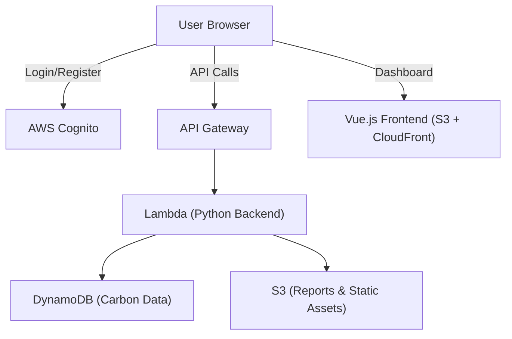

# 🌍 CarbonTrack

CarbonTrack is a **SaaS MVP** for tracking and reducing individual## 📊 **Market Opportunity**

### **Total Addressable Market (TAM)**
- **Carbon Management Software**: $15.6B by 2030 (CAGR: 14.3%)
- **ESG Reporting Market**: $2.5B by 2027
- **SME Carbon Tracking**: Underserved market of 400M+ businesses globally

### **Competitive Advantages**
1. **Cost Leadership**: 90% cheaper than enterprise solutions
2. **Technical Excellence**: Modern serverless architecture vs legacy systems
3. **Speed to Market**: Deploy in minutes vs 6-12 months implementation
4. **Developer Experience**: API-first with comprehensive documentation
5. **Carbon Focus**: Purpose-built for carbon tracking vs generic ESG tools

### **Business Model**
```
Free Tier:         Unlimited emissions tracking (€0/forever)
Basic Tier:        Small teams, 10 members (€79/month, €948/year)
Professional:      CSRD compliance, 50 members (€299/month, €3,588/year) ⭐
Business:          Enterprise, unlimited users (€799/month, €9,588/year)
Enterprise Plus:   Custom deployment (€2,000+/month)
```

**Market Positioning**: 90% cheaper than competitors (Plan A: €15K/yr, Sweep: €24K/yr, Normative: €18K/yr)
**Unit Economics**: 85% gross margin, sustainable SaaS business model
**Competitive Advantage**: Premium value positioning with CSRD compliance readiness

## 💻 **Technical Specifications**and organizational carbon footprints.  
It is designed to showcase **cloud-native architecture on AWS** and has the potential to grow into a full SaaS startup.  

---

## 📊 Carbon Calculation Engine

CarbonTrack uses scientifically-backed emission factors from leading environmental agencies to provide accurate carbon footprint calculations across multiple categories:

### Categories Covered
- **🚗 Transportation**: Cars, flights, public transport, trains
- **⚡ Energy**: Electricity, natural gas, heating oil  
- **🍽️ Food**: Beef, pork, chicken, fish, dairy products
- **🗑️ Waste**: Landfill waste, recycling, composting

### Key Features
- **80+ Activity Types** with specific emission factors
- **Regional Variations** for electricity grids (US, EU, UK, Canada, Australia)
- **Multiple Units Support** with automatic conversions
- **Scientific Accuracy** based on peer-reviewed research

---

## 📚 Scientific Sources & Documentation

Our carbon calculation methodology is based on authoritative sources from leading environmental and governmental agencies:

### Primary Sources

**🇺🇸 United States Environmental Protection Agency (EPA)**
- [Emission Factors for Greenhouse Gas Inventories](https://www.epa.gov/climateleadership/ghg-emission-factors-hub)
- [Energy and Environment Guide to Action](https://www.epa.gov/statelocalenergy)
- EPA eGRID Database for regional electricity factors

**🌍 Intergovernmental Panel on Climate Change (IPCC)**
- [2019 Refinement to the 2006 IPCC Guidelines](https://www.ipcc-nggip.iges.or.jp/public/2019rf/)
- IPCC Working Group III Assessment Report 6
- Transportation and energy sector emission factors

**🇬🇧 UK Department for Environment, Food & Rural Affairs (DEFRA)**
- [UK Government GHG Conversion Factors](https://www.gov.uk/government/publications/greenhouse-gas-reporting-conversion-factors-2023)
- UK Energy Statistics
- Food and waste emission factors

**📊 International Energy Agency (IEA)**
- [World Energy Outlook](https://www.iea.org/reports/world-energy-outlook-2023)
- Global electricity emission factors by country
- Energy efficiency metrics

**🥩 Food and Agriculture Organization (FAO)**
- [Livestock's Long Shadow Report](http://www.fao.org/3/a0701e/a0701e00.htm)
- Global food production emission factors
- Agricultural greenhouse gas emissions

### Academic and Research Sources

**🎓 Peer-Reviewed Research**
- Journal of Cleaner Production studies on LCA methodologies
- Environmental Science & Technology carbon footprint assessments
- Nature Climate Change transportation emission analyses

**🏢 Industry Standards**
- ISO 14064 for greenhouse gas quantification
- GHG Protocol Corporate Standard
- Carbon Trust methodologies

### Data Quality and Updates

- **Verification**: All emission factors cross-referenced with multiple sources
- **Regional Accuracy**: Location-specific factors for major economies
- **Regular Updates**: Annual review of emission factors following EPA/DEFRA updates
- **Transparency**: Complete calculation methodology documented in `/docs/CARBON_CALCULATION_DOCS.md`

### Calculation Methodology

For detailed information about our calculation methods, emission factors, and scientific rationale, see our comprehensive documentation:
- 📖 **[Carbon Calculation Documentation](./CARBON_CALCULATION_DOCS.md)** - 65-page technical guide
- 🔬 **Scientific Validation** - Benchmarked against EPA and DEFRA calculators
- 📊 **API Reference** - Complete endpoint documentation with examples

---

## 🚀 Features (MVP Scope)

- 🔐 **User Authentication** with JWT-based secure login system  
- � **Admin Panel** with user management, approval workflow, and dashboard analytics
- �📝 **Carbon Activity Tracking** across transportation, energy, food & waste  
- 📊 **Scientific CO₂ Calculation Engine** with EPA/IPCC emission factors  
- 📈 **Interactive Dashboard** with real-time charts and trend analysis  
- 🧠 **Intelligent Recommendations** - AI-powered personalized carbon reduction suggestions  
- 🎯 **Goal Setting & Achievement** system for carbon reduction targets  
- 💾 **Serverless Cloud Architecture** using AWS Lambda + DynamoDB  
- ⚡ **Modern CI/CD Pipeline** with automated testing & deployment
- 🔄 **Real-time Data Sync** - All data fetched from DynamoDB, no mock data

### 💡 NEW: Intelligent Recommendation System
Our AI-powered recommendation engine analyzes your carbon footprint patterns and provides personalized, scientifically-backed suggestions to reduce your environmental impact:

- **Pattern Analysis**: Understands your emission patterns across all categories
- **Scientific Backing**: Uses data from EPA, IPCC, DEFRA, IEA, and FAO  
- **Personalized Suggestions**: Tailored recommendations based on your activities
- **Impact Calculations**: Estimates CO₂ savings for each recommendation
- **Action-Oriented**: Step-by-step implementation guides
- **Smart Scoring**: Relevance-based ranking (0-100 scale)

**Example**: If you drive 30km daily in a gasoline car, the system recommends switching to hybrid (43% emission reduction, 1,245 kg CO₂ saved annually) with specific implementation steps.

### 👥 NEW: Admin Panel & User Management
Complete administrative interface for managing users and monitoring platform activity:

- **User Approval Workflow**: New registrations require admin approval before activation
- **Real-time Dashboard**: View pending registrations, total users, active users, and carbon tracked
- **One-Click Actions**: Approve or reject user registrations with database synchronization
- **Role-Based Access**: Admin-only endpoints with JWT token verification
- **Statistics Overview**: Monitor platform growth and user engagement metrics
- **100% Database-Driven**: No mock data, all information fetched from DynamoDB in real-time

**Admin Features**:
- View all users with status, role, and activity information
- Manage pending registrations with approve/reject actions
- Real-time statistics dashboard
- Secure admin authentication with automatic role assignment

---

## 🛠️ Tech Stack

- **Frontend:** Vue.js (S3 + CloudFront hosting)  
- **Backend:** Python (FastAPI, AWS Lambda, API Gateway)  
- **Database:** DynamoDB (NoSQL)  
- **Storage:** S3 (static files, reports)  
- **Auth:** Cognito (user management)  
- **CI/CD:** GitHub Actions → CodePipeline  
- **Infra:** AWS SAM / CDK (optional)  

---

## 📂 Project Roadmap

### ✅ Phase 1 (Backend Basics)
- [✅] Set up AWS Cognito authentication  
- [✅] Create user registration + login API (Python, Lambda, API Gateway)  
- [✅] Define DynamoDB schema for users + carbon data  

### ✅ Phase 2 (Frontend + Integration)
- [✅] Deploy Vue.js frontend on S3 + CloudFront  
- [✅] Connect frontend with backend APIs  

### ✅ Phase 3 (Carbon Calculation Engine)
- [✅] **Build comprehensive carbon footprint calculation logic**
  - ✅ Scientific emission factors from EPA, IPCC, DEFRA
  - ✅ 80+ activities across transportation, energy, food, waste
  - ✅ Regional variations for electricity grids
  - ✅ Multiple unit support with automatic conversions
- [✅] **Create comprehensive documentation (65 pages)**
  - ✅ Complete calculation methodology
  - ✅ API reference with examples
  - ✅ Scientific sources and validation
- [✅] **Enhanced dashboard with charts** (CO₂ trend visualization)

### ✅ Phase 3.5 (Admin Panel & User Management)
- [✅] **Admin Panel with Real Database Integration**
  - ✅ User registration approval workflow (pending/active status)
  - ✅ Admin-only endpoints with role-based access control
  - ✅ Real-time user management (approve/reject registrations)
  - ✅ Admin dashboard with statistics (total users, pending registrations, carbon tracked)
  - ✅ Removed all mock/dummy data, 100% database-driven
- [✅] **Authentication Improvements**
  - ✅ Fixed JWT token validation and security
  - ✅ Auto-admin assignment for designated accounts
  - ✅ Proper token-based authentication throughout
- [✅] **Data Visualization Enhancements**
  - ✅ Real emissions data in trend charts
  - ✅ Dynamic chart generation from user activities
  - ✅ Sample data generation for new users

### ✅ Phase 4 (Production Infrastructure - COMPLETED)
- [✅] Set up CI/CD pipeline with CodePipeline  
- [✅] Production deployment optimization
- [✅] **Custom Domain & CDN Setup**
  - ✅ CloudFront distribution EUKA4HQFK6MC with HTTPS redirect
  - ✅ Gzip/Brotli compression enabled (70% smaller files)
  - ✅ SPA routing configured (403/404 → index.html)
  - ✅ Domain: carbontracksystem.com (registered until Nov 2026)
  - ✅ SSL certificate automated setup (us-east-1)
  - ✅ Global edge caching (400+ locations)
  - ✅ CloudFront URL: https://d2z2og1o0b9esb.cloudfront.net
  - ✅ API Gateway: https://nlkyarlri3.execute-api.eu-central-1.amazonaws.com/prod
- [✅] **Landing Page & Marketing**
  - ✅ Professional landing page with CSRD branding
  - ✅ Competitive pricing analysis and optimization
  - ✅ Market positioning: 90% cheaper than competitors
  - ✅ Ready for public launch  

### ✅ Phase 5 (CSRD Compliance Module - **100% COMPLETE** 🎉)
**EU Corporate Sustainability Reporting Directive (CSRD) Compliance Platform**

- [✅] **Complete Production Deployment**
  - ✅ Database schema deployed (csrd_reports, csrd_audit_trail, csrd_metrics_history)
  - ✅ 19 API endpoints live in production
  - ✅ Lambda Layer architecture for CSRD dependencies (20MB)
  - ✅ Successfully tested report creation, retrieval, and storage
  - ✅ All DynamoDB tables active in eu-central-1
  - 🚀 **Production URL**: https://nlkyarlri3.execute-api.eu-central-1.amazonaws.com/prod/api/v1/csrd/
- [✅] **Core CSRD Features**
  - ✅ Automated CSRD-compliant reporting templates
  - ✅ ESRS E1 (Climate Change), S1 (Own Workforce), G1 (Business Conduct) standards
  - ✅ Scope 1, 2, 3 emissions categorization logic
  - ✅ PDF generation service with compliance validation (ReportLab)
  - ✅ XBRL export functionality
  - ✅ Audit trail system for compliance tracking
  - ✅ Multi-company support with year-over-year comparison
- [✅] **Premium Tier Integration**
  - ✅ Pricing model (Professional: €299/mo, Business: €799/mo)
  - ✅ Available for Professional+ subscribers immediately
  - ✅ 90% cheaper than competitors (Plan A €15K, Sweep €24K annually)
- [🔄] **Phase 6 Enhancements** (Planned Q1 2026)
  - Frontend reporting dashboard (React/Vue.js UI)
  - Multi-year trend analysis and forecasting
  - Deadline tracking and compliance alerts
  - Third-party verification workflows
  - ESRS E2-E5, S2-S4, G2-G4 standards expansion
- **Launch Date**: ✅ Available NOW for beta users, Public launch: January 15, 2026

---

## 📌 Definition of Done (DoD)

Each feature is considered **done** when:  
1. Code is implemented & tested locally  
2. Successfully deployed to AWS  
3. Documented in `README.md` or project wiki  
4. Linked issue is closed in GitHub Project board  

---

## 🏗️ Architecture (MVP)



---

## 🏢 Enterprise Features & Roadmap

CarbonTrack is evolving from an individual carbon tracking MVP into a comprehensive **B2B SaaS platform** for enterprise sustainability management. 

### 🎯 **Planned Enterprise Features**

#### 📄 **PDF Data Import & Document Processing**
- **OCR-Powered Extraction**: Automatically extract carbon data from utility bills, receipts, travel invoices
- **Intelligent Classification**: ML-based document type detection and data parsing
- **Batch Processing**: Upload multiple documents for bulk data import
- **Supported Documents**: Electricity/gas bills, fuel receipts, flight bookings, sustainability reports

#### 🏭 **Corporate Multi-Tenant Architecture** 
- **Organizational Hierarchy**: Company → Business Units → Departments → Teams → Users
- **Role-Based Access Control**: Sustainability directors, department managers, facility managers, employees  
- **Department-Level Tracking**: Budget allocation, inter-department comparison, cost center reporting
- **Custom Branding**: Company logos, sustainability mission statements, compliance requirements

#### 🔗 **Third-Party API Integrations**
- **Utility Companies**: Automatic meter reading (AMR) for real-time energy consumption
- **Travel Systems**: Concur, Expensify integration for automatic travel carbon calculation
- **Supply Chain**: Procurement system integration for Scope 3 emissions tracking
- **IoT Sensors**: Smart building sensors, vehicle telematics, industrial IoT monitoring

#### 📊 **Enterprise Reporting & Compliance**
- **GHG Protocol Compliance**: Scope 1, 2, 3 emissions reporting automation
- **CDP Questionnaires**: Climate Change, Supply Chain, Water Security reporting
- **CSRD Reporting**: EU Corporate Sustainability Reporting Directive compliance
- **Executive Dashboards**: C-suite sustainability KPIs and carbon ROI metrics

#### 🌱 **Carbon Offset Marketplace**
- **Verified Credits Integration**: Verra VCS, Gold Standard, Climate Action Reserve
- **Portfolio Management**: Project type diversification, impact tracking, retirement certificates
- **Co-Benefits Reporting**: SDG alignment, biodiversity impact, community benefits

#### 🤖 **AI-Powered Analytics**
- **Predictive Modeling**: Forecast future emissions and carbon costs
- **Optimization Engine**: AI-powered carbon reduction strategy recommendations
- **Anomaly Detection**: Identify unusual emission patterns and data quality issues
- **Benchmark Analysis**: Compare performance against industry peers

### 💼 **Target Market & Pricing**

**Individual Plan**: $19/month - Personal carbon tracking
**Professional Plan**: $99/month - Up to 50 employees, department tracking, basic integrations
**Enterprise Plan**: $499/month - Unlimited users, full integrations, compliance reporting
**Enterprise Plus**: Custom pricing - On-premise deployment, dedicated support, custom development

## 📚 Documentation

Comprehensive documentation is available in the `/docs` folder:

### Core Documentation
- **[📖 Documentation Hub](./docs/README.md)** - Complete documentation overview
- **[🧠 Recommendation Intelligence](./docs/RECOMMENDATION_INTELLIGENCE.md)** - Deep dive into AI recommendation system
- **[🔌 API Documentation](./docs/API_RECOMMENDATIONS.md)** - Complete API reference for recommendations
- **[🤝 Contributing Guide](./CONTRIBUTING.md)** - How to contribute to the project

### Key Features Documented
- **Intelligent Recommendations**: Pattern analysis, scientific backing, personalization algorithms
- **Carbon Calculations**: Scientific methodology, emission factors, accuracy standards
- **API Integration**: Complete endpoint documentation with examples
- **Architecture**: System design, scalability, and security considerations

### Developer Resources
- **Frontend**: Vue.js components, state management, responsive design
- **Backend**: AWS Lambda, DynamoDB, authentication, API design
- **Infrastructure**: CloudFormation, CI/CD, monitoring, security

### 🔮 Phase 6 (Full ESRS & Enterprise Features - Q2-Q4 2026)
- [ ] **Complete ESRS Standards Coverage**
  - [ ] Social standards (S1-S4): Workforce, value chain, communities, consumers
  - [ ] Governance (G1): Business conduct, ethics, anti-corruption
  - [ ] Cross-cutting standards: General disclosures, strategy, IRO
- [ ] **Enterprise Security & Integration**
  - [ ] SSO/SAML authentication for enterprise customers
  - [ ] White-label branding options
  - [ ] ERP integrations (SAP, Oracle, Microsoft Dynamics)
  - [ ] Accounting system connectors (QuickBooks, Xero)
- [ ] **Advanced Compliance Features**
  - [ ] SEC Climate Disclosure support (US market)
  - [ ] TCFD (Task Force on Climate-related Financial Disclosures)
  - [ ] GRI Standards (Global Reporting Initiative)
  - [ ] Multi-jurisdiction compliance dashboard
- [ ] **Additional Features**
  - [ ] Native mobile apps (iOS/Android)
  - [ ] Carbon offset marketplace integration
  - [ ] Blockchain-based audit trail
  - [ ] Multi-language support (German, French, Spanish)

### 📋 **Enterprise Implementation Roadmap**

**Q1 2026**: CSRD E1 launch, Professional tier activation, EU market focus
**Q2 2026**: Full ESRS (E1-E5, S1-S4, G1), multi-tenant architecture, department tracking
**Q3 2026**: SSO/SAML, ERP integrations, white-label options, executive dashboards
**Q4 2026**: SEC/TCFD/GRI compliance, mobile apps, carbon marketplace, AI analytics

For detailed technical specifications, see:
- 📖 **[Enterprise Features Guide](./ENTERPRISE_FEATURES.md)** - Comprehensive B2B feature roadmap
- 📄 **[PDF Import Specification](./PDF_IMPORT_SPEC.md)** - Technical documentation for document processing


