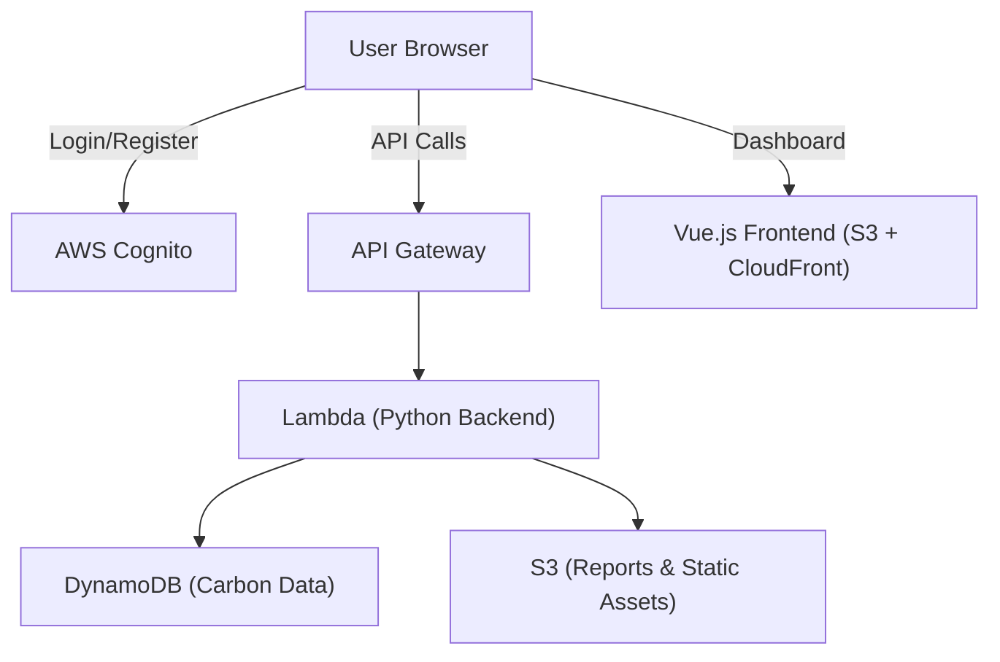

# 🌍 CarbonTrack

CarbonTrack is a **SaaS MVP** for tracking and reducing individual## 📊 **Market Opportunity**

### **Total Addressable Market (TAM)**
- **Carbon Management Software**: $15.6B by 2030 (CAGR: 14.3%)
- **ESG Reporting Market**: $2.5B by 2027
- **SME Carbon Tracking**: Underserved market of 400M+ businesses globally

### **Competitive Advantages**
1. **Cost Leadership**: 90% cheaper than enterprise solutions
2. **Technical Excellence**: Modern serverless architecture vs legacy systems
3. **Speed to Market**: Deploy in minutes vs 6-12 months implementation
4. **Developer Experience**: API-first with comprehensive documentation
5. **Carbon Focus**: Purpose-built for carbon tracking vs generic ESG tools

### **Business Model**
```
Free Tier:     0-100 emissions/month (€0)
Basic Tier:    101-1,000 emissions/month (€9.99)
Pro Tier:      Unlimited + Analytics (€29.99)  
Enterprise:    Custom pricing + white-label
```

**Unit Economics**: 85% gross margin, €2.50 CAC, €180 LTV

## 💻 **Technical Specifications**and organizational carbon footprints.  
It is designed to showcase **cloud-native architecture on AWS** and has the potential to grow into a full SaaS startup.  

---

## 📊 Carbon Calculation Engine

CarbonTrack uses scientifically-backed emission factors from leading environmental agencies to provide accurate carbon footprint calculations across multiple categories:

### Categories Covered
- **🚗 Transportation**: Cars, flights, public transport, trains
- **⚡ Energy**: Electricity, natural gas, heating oil  
- **🍽️ Food**: Beef, pork, chicken, fish, dairy products
- **🗑️ Waste**: Landfill waste, recycling, composting

### Key Features
- **80+ Activity Types** with specific emission factors
- **Regional Variations** for electricity grids (US, EU, UK, Canada, Australia)
- **Multiple Units Support** with automatic conversions
- **Scientific Accuracy** based on peer-reviewed research

---

## 📚 Scientific Sources & Documentation

Our carbon calculation methodology is based on authoritative sources from leading environmental and governmental agencies:

### Primary Sources

**🇺🇸 United States Environmental Protection Agency (EPA)**
- [Emission Factors for Greenhouse Gas Inventories](https://www.epa.gov/climateleadership/ghg-emission-factors-hub)
- [Energy and Environment Guide to Action](https://www.epa.gov/statelocalenergy)
- EPA eGRID Database for regional electricity factors

**🌍 Intergovernmental Panel on Climate Change (IPCC)**
- [2019 Refinement to the 2006 IPCC Guidelines](https://www.ipcc-nggip.iges.or.jp/public/2019rf/)
- IPCC Working Group III Assessment Report 6
- Transportation and energy sector emission factors

**🇬🇧 UK Department for Environment, Food & Rural Affairs (DEFRA)**
- [UK Government GHG Conversion Factors](https://www.gov.uk/government/publications/greenhouse-gas-reporting-conversion-factors-2023)
- UK Energy Statistics
- Food and waste emission factors

**📊 International Energy Agency (IEA)**
- [World Energy Outlook](https://www.iea.org/reports/world-energy-outlook-2023)
- Global electricity emission factors by country
- Energy efficiency metrics

**🥩 Food and Agriculture Organization (FAO)**
- [Livestock's Long Shadow Report](http://www.fao.org/3/a0701e/a0701e00.htm)
- Global food production emission factors
- Agricultural greenhouse gas emissions

### Academic and Research Sources

**🎓 Peer-Reviewed Research**
- Journal of Cleaner Production studies on LCA methodologies
- Environmental Science & Technology carbon footprint assessments
- Nature Climate Change transportation emission analyses

**🏢 Industry Standards**
- ISO 14064 for greenhouse gas quantification
- GHG Protocol Corporate Standard
- Carbon Trust methodologies

### Data Quality and Updates

- **Verification**: All emission factors cross-referenced with multiple sources
- **Regional Accuracy**: Location-specific factors for major economies
- **Regular Updates**: Annual review of emission factors following EPA/DEFRA updates
- **Transparency**: Complete calculation methodology documented in `/docs/CARBON_CALCULATION_DOCS.md`

### Calculation Methodology

For detailed information about our calculation methods, emission factors, and scientific rationale, see our comprehensive documentation:
- 📖 **[Carbon Calculation Documentation](./CARBON_CALCULATION_DOCS.md)** - 65-page technical guide
- 🔬 **Scientific Validation** - Benchmarked against EPA and DEFRA calculators
- 📊 **API Reference** - Complete endpoint documentation with examples

---

## �🚀 Features (MVP Scope)

- 🔐 **User Authentication** with AWS Cognito  
- 📝 **Data Input** for energy usage & travel records  
- 📊 **CO₂ Calculation Engine** (Python backend)  
- 📈 **Dashboard** with charts to visualize emissions over time  
- 💾 **Serverless Storage** using DynamoDB + S3  
- ⚡ **CI/CD Pipeline** with AWS CodePipeline  

---

## 🛠️ Tech Stack

- **Frontend:** Vue.js (S3 + CloudFront hosting)  
- **Backend:** Python (FastAPI, AWS Lambda, API Gateway)  
- **Database:** DynamoDB (NoSQL)  
- **Storage:** S3 (static files, reports)  
- **Auth:** Cognito (user management)  
- **CI/CD:** GitHub Actions → CodePipeline  
- **Infra:** AWS SAM / CDK (optional)  

---

## 📂 Project Roadmap

### ✅ Phase 1 (Backend Basics)
- [✅] Set up AWS Cognito authentication  
- [✅] Create user registration + login API (Python, Lambda, API Gateway)  
- [✅] Define DynamoDB schema for users + carbon data  

### ✅ Phase 2 (Frontend + Integration)
- [✅] Deploy Vue.js frontend on S3 + CloudFront  
- [✅] Connect frontend with backend APIs  

### ✅ Phase 3 (Carbon Calculation Engine)
- [✅] **Build comprehensive carbon footprint calculation logic**
  - ✅ Scientific emission factors from EPA, IPCC, DEFRA
  - ✅ 80+ activities across transportation, energy, food, waste
  - ✅ Regional variations for electricity grids
  - ✅ Multiple unit support with automatic conversions
- [✅] **Create comprehensive documentation (65 pages)**
  - ✅ Complete calculation methodology
  - ✅ API reference with examples
  - ✅ Scientific sources and validation
- [✅] **Enhanced dashboard with charts** (CO₂ trend visualization)

### 🔮 Phase 4 (Production & CI/CD)
- [ ] Set up CI/CD pipeline with CodePipeline  
- [ ] Production deployment optimization
- [ ] Performance monitoring and analytics  

---

## 📌 Definition of Done (DoD)

Each feature is considered **done** when:  
1. Code is implemented & tested locally  
2. Successfully deployed to AWS  
3. Documented in `README.md` or project wiki  
4. Linked issue is closed in GitHub Project board  

---

## 🏗️ Architecture (MVP)



---

## 🏢 Enterprise Features & Roadmap

CarbonTrack is evolving from an individual carbon tracking MVP into a comprehensive **B2B SaaS platform** for enterprise sustainability management. 

### 🎯 **Planned Enterprise Features**

#### 📄 **PDF Data Import & Document Processing**
- **OCR-Powered Extraction**: Automatically extract carbon data from utility bills, receipts, travel invoices
- **Intelligent Classification**: ML-based document type detection and data parsing
- **Batch Processing**: Upload multiple documents for bulk data import
- **Supported Documents**: Electricity/gas bills, fuel receipts, flight bookings, sustainability reports

#### 🏭 **Corporate Multi-Tenant Architecture** 
- **Organizational Hierarchy**: Company → Business Units → Departments → Teams → Users
- **Role-Based Access Control**: Sustainability directors, department managers, facility managers, employees  
- **Department-Level Tracking**: Budget allocation, inter-department comparison, cost center reporting
- **Custom Branding**: Company logos, sustainability mission statements, compliance requirements

#### 🔗 **Third-Party API Integrations**
- **Utility Companies**: Automatic meter reading (AMR) for real-time energy consumption
- **Travel Systems**: Concur, Expensify integration for automatic travel carbon calculation
- **Supply Chain**: Procurement system integration for Scope 3 emissions tracking
- **IoT Sensors**: Smart building sensors, vehicle telematics, industrial IoT monitoring

#### 📊 **Enterprise Reporting & Compliance**
- **GHG Protocol Compliance**: Scope 1, 2, 3 emissions reporting automation
- **CDP Questionnaires**: Climate Change, Supply Chain, Water Security reporting
- **CSRD Reporting**: EU Corporate Sustainability Reporting Directive compliance
- **Executive Dashboards**: C-suite sustainability KPIs and carbon ROI metrics

#### 🌱 **Carbon Offset Marketplace**
- **Verified Credits Integration**: Verra VCS, Gold Standard, Climate Action Reserve
- **Portfolio Management**: Project type diversification, impact tracking, retirement certificates
- **Co-Benefits Reporting**: SDG alignment, biodiversity impact, community benefits

#### 🤖 **AI-Powered Analytics**
- **Predictive Modeling**: Forecast future emissions and carbon costs
- **Optimization Engine**: AI-powered carbon reduction strategy recommendations
- **Anomaly Detection**: Identify unusual emission patterns and data quality issues
- **Benchmark Analysis**: Compare performance against industry peers

### 💼 **Target Market & Pricing**

**Individual Plan**: $19/month - Personal carbon tracking
**Professional Plan**: $99/month - Up to 50 employees, department tracking, basic integrations
**Enterprise Plan**: $499/month - Unlimited users, full integrations, compliance reporting
**Enterprise Plus**: Custom pricing - On-premise deployment, dedicated support, custom development

### 📋 **Implementation Roadmap**

**Phase 1 (Q1 2026)**: Multi-tenant architecture, PDF import, department tracking
**Phase 2 (Q2 2026)**: API integrations, advanced reporting, compliance automation  
**Phase 3 (Q3 2026)**: Carbon marketplace, supply chain tracking, executive dashboards
**Phase 4 (Q4 2026)**: AI analytics, predictive modeling, optimization engine

For detailed technical specifications, see:
- 📖 **[Enterprise Features Guide](./ENTERPRISE_FEATURES.md)** - Comprehensive B2B feature roadmap
- 📄 **[PDF Import Specification](./PDF_IMPORT_SPEC.md)** - Technical documentation for document processing


