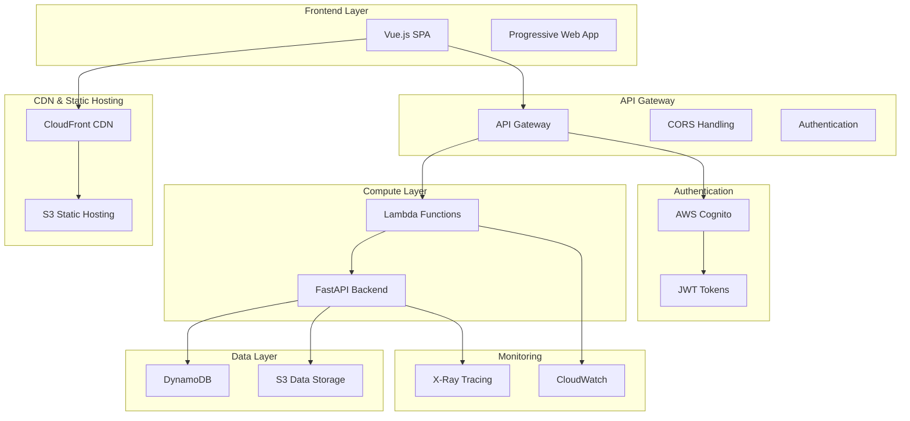
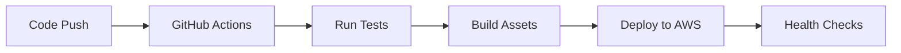

# 🏗️ Architecture Overview

CarbonTrack is built using modern **cloud-native architecture** principles, designed for scalability, maintainability, and cost-effectiveness.

---

## 🎯 **Design Philosophy**

### Core Principles
- **🚀 Serverless-First** - Automatic scaling with zero infrastructure management
- **📱 Mobile-First** - Responsive design for all devices
- **🔒 Security-by-Design** - Built-in authentication and authorization  
- **💰 Cost-Optimized** - Pay-per-use with minimal fixed costs
- **⚡ Performance-Focused** - Sub-second response times globally

### Architecture Goals
- **Scalability**: Handle 0-1M+ users seamlessly
- **Reliability**: 99.9% uptime with automatic failover
- **Maintainability**: Clean code with comprehensive documentation
- **Extensibility**: Easy to add new features and integrations

---

## 🏛️ **System Architecture**



---

## 🧩 **Component Breakdown**

### 🎨 **Frontend Architecture**

#### **Technology Stack**
- **Vue.js 3** - Reactive JavaScript framework
- **Composition API** - Modern component architecture
- **Tailwind CSS** - Utility-first styling
- **Chart.js** - Data visualization
- **Axios** - HTTP client

#### **Key Components**
```
frontend/
├── index.html          # Main application entry
├── app-full.js         # Core application logic
├── components/         # Reusable Vue components
├── assets/            # Static assets (images, fonts)
└── styles/            # Custom CSS and themes
```

#### **State Management**
- **Reactive Data** - Vue 3 reactivity system
- **Local Storage** - Client-side persistence
- **Session Management** - JWT token handling
- **Real-time Updates** - WebSocket connections (planned)

### ⚙️ **Backend Architecture**

#### **Technology Stack**
- **FastAPI** - High-performance Python framework
- **Pydantic** - Data validation and serialization
- **AWS Lambda** - Serverless compute
- **Mangum** - ASGI adapter for Lambda

#### **Service Structure**
```
backend/
├── app/
│   ├── api/v1/         # API endpoints
│   ├── core/          # Configuration and utilities
│   ├── models/        # Data models
│   ├── services/      # Business logic
│   └── schemas/       # API schemas
├── tests/             # Test suite
└── requirements.txt   # Dependencies
```

#### **Service Layer**
- **Achievement Engine** - Gamification logic
- **Carbon Calculator** - Emission calculations  
- **User Service** - User management
- **Analytics Service** - Data processing
- **Notification Service** - Email/push notifications

### 🗄️ **Data Architecture**

#### **Database Design**
- **DynamoDB** - Primary NoSQL database
- **Single-table Design** - Optimized for serverless
- **GSI Patterns** - Efficient query patterns
- **Time-series Data** - Emission tracking over time

#### **Data Models**
```python
# Core Entities
User         # User profiles and preferences
Emission     # Carbon footprint entries
Achievement  # Gamification achievements  
Goal         # User sustainability goals
Activity     # User actions and behaviors
```

### 🔐 **Security Architecture**

#### **Authentication Flow**
1. **User Registration** → AWS Cognito
2. **JWT Token Generation** → Signed tokens
3. **API Authorization** → Token validation
4. **Role-based Access** → Admin/user permissions

#### **Security Measures**
- **HTTPS Everywhere** - TLS 1.3 encryption
- **CORS Configuration** - Cross-origin protection
- **Input Validation** - Pydantic schemas
- **SQL Injection Prevention** - NoSQL design
- **Rate Limiting** - API Gateway throttling

---

## 🚀 **Deployment Architecture**

### **Infrastructure as Code**
```yaml
# CloudFormation Template Structure
Resources:
  - API Gateway
  - Lambda Functions  
  - DynamoDB Tables
  - Cognito User Pool
  - S3 Buckets
  - CloudFront Distribution
  - Route 53 DNS
```

### **CI/CD Pipeline**


### **Environment Strategy**
- **Development** - Local Docker containers
- **Staging** - AWS with limited resources
- **Production** - Full AWS deployment with monitoring

---

## 📊 **Performance Characteristics**

### **Scalability Metrics**
- **Cold Start**: <500ms for Lambda functions
- **API Response**: <200ms average response time
- **Concurrent Users**: 1000+ simultaneous users
- **Database**: Auto-scaling DynamoDB
- **Static Assets**: Global CDN distribution

### **Cost Optimization**
- **Serverless**: Pay only for actual usage
- **Auto-scaling**: No idle resource costs
- **CDN Caching**: Reduced bandwidth costs
- **Efficient Queries**: Optimized database access

---

## 🔍 **Monitoring & Observability**

### **Application Monitoring**
- **CloudWatch Logs** - Centralized logging
- **X-Ray Tracing** - Request flow tracking
- **Custom Metrics** - Business KPIs
- **Alarms & Notifications** - Proactive monitoring

### **Performance Tracking**
- **Real User Monitoring** - Frontend performance
- **API Metrics** - Response times and errors
- **Database Performance** - Query optimization
- **Cost Tracking** - AWS cost analysis

---

## 🔄 **Data Flow**

### **User Interaction Flow**
1. **Frontend Request** → API Gateway
2. **Authentication** → JWT validation
3. **Business Logic** → Lambda execution
4. **Data Persistence** → DynamoDB write
5. **Response** → JSON to frontend
6. **UI Update** → Vue reactivity

### **Carbon Calculation Flow**
1. **User Input** → Activity data
2. **Validation** → Pydantic schemas
3. **Calculation** → Scientific algorithms
4. **Storage** → Time-series data
5. **Analytics** → Trend analysis
6. **Insights** → Recommendations

---

## 🧪 **Testing Strategy**

### **Test Pyramid**
- **Unit Tests** - Individual functions (80%)
- **Integration Tests** - Service interactions (15%)  
- **E2E Tests** - Full user workflows (5%)

### **Testing Tools**
- **pytest** - Python testing framework
- **Jest** - JavaScript unit testing
- **Cypress** - End-to-end testing
- **Postman** - API testing

---

## 🔮 **Future Architecture Considerations**

### **Planned Enhancements**
- **Microservices** - Service decomposition for scale
- **Event-Driven** - Async processing with SQS/SNS
- **Machine Learning** - AI-powered recommendations
- **Real-time Features** - WebSocket for live updates
- **Multi-tenant** - Enterprise customer isolation

### **Scalability Roadmap**
- **Caching Layer** - Redis for session management
- **CDN Optimization** - Edge computing with Lambda@Edge
- **Database Sharding** - Horizontal scaling strategies
- **Global Deployment** - Multi-region architecture

---

## 📚 **Related Documentation**

- [**API Documentation**](API-Documentation.md) - Complete API reference
- [**Database Schema**](Database-Schema.md) - Data models and relationships
- [**Deployment Guide**](Deployment-Guide.md) - Production deployment
- [**Security Guide**](Security-Guide.md) - Security best practices

---

*Scalable by design, sustainable by purpose* 🌱